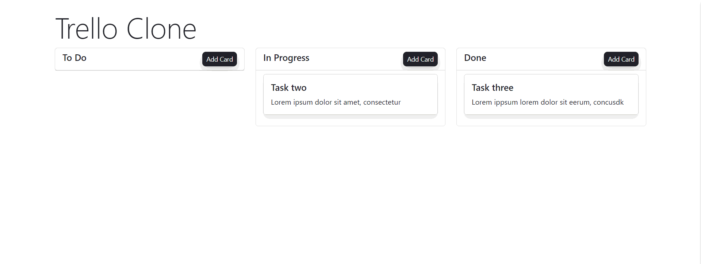

# Trello Clone App

> ## For Detailed documentation, kindly go through the pdf [here](https://drive.google.com/file/d/1YdHYhEklG2kkdhQ-2iMHNqpiBKgmNFtd/view?usp=sharing)

> ## 🚀 [Deployed Link](https://trello-v1-dusky.vercel.app/) - Click here for live preview

## Installation

1. Clone the repository from GitHub:

   > git clone https://github.com/Bhikule19/trello-v1

2. Navigate to the project directory:

   > cd trello-v1

3. Install the dependencies:
   > npm install

## Running the Application

To run the application locally, use the following command:

> npm start

## Building Components

The application is built using React components. Here's a brief overview of the main components:

### Board Component

The Board component is the main component that manages the state of the columns and cards. It initializes the columns and cards data from the browser's localStorage, or with a default set of columns if no data is stored.

The Board component is the main component that manages the state of the columns and cards. It initializes the columns and cards data from the browser's localStorage, or with a default set of columns if no data is stored.

The Board component provides methods for adding, editing, deleting, and updating cards, as well as handling the opening and closing of the modal for these actions.

### Column Component

The Column component represents a single column on the board. It renders the column title, an "Add Card" button, and a list of Card components for the cards within the column.

The Column component also handles the drag and drop functionality for moving cards between columns using the handleDragOver and handleDrop utility functions.

### Card Component

The Card component represents a single card within a column. It displays the card's title and description, and handles the drag and drop functionality for moving cards within the same column or to other columns.

### AddCardModal Component

The AddCardModal component is a modal dialog that allows users to add a new card or edit an existing card. It displays input fields for the card's title, description, and the column to which the card should be added or moved.

The AddCardModal component performs input validation to ensure that the title is alphanumeric and the description has at least 25 characters. It also provides buttons for adding/updating a card or deleting an existing card.

## Rendering

The Board component is the root component of the application and is responsible for rendering the columns and the AddCardModal component.

> 

      <heading>
        <h1 className="display-3">Trello Clone</h1>
      </heading>

      

        {columns.map((column) => (
          <Column
            key={column.id}
            className="col-md-4 col-sm-6"
            column={column}
            onAddCard={handleOpenModal}
            onEditCard={handleOpenModal}
            updateCard={updateCard}
            onDeleteCard={handleDeleteCard}
          />
        ))}
      

      <AddCardModal
        show={showModal}
        onClose={handleCloseModal}
        onAddCard={handleAddCard}
        onEditCard={handleEditCard}
        onDeleteCard={handleDeleteCard}
        editingCard={editingCard}
      />
    

The Column components are rendered within a CSS grid layout, and each Column component renders its respective cards using the Card component.

## Functionality

### 1. Adding a Card

- To add a new card, click the "Add Card" button in the column where you want to add the card. This will open the AddCardModal component. Enter the title, description, and select the column where you want to add the card, then click the "Add Card" button.
  

- When the user clicks the "Add Card" button in a column, the AddCardModal component is rendered with an empty form. The user can then enter the title, description, and select the column where they want to add the card.

### 2. Editing a Card

- When the user clicks on an existing card, the AddCardModal component is opened with the card's current data pre-filled in the form fields. The handleOpenModal function in the Board component is called, which sets the editingCard state to the clicked card object and opens the modal by setting the showModal state to true.

- In the AddCardModal component, the useEffect hook is used to update the title, description, and columnId state variables with the corresponding values from the editingCard object when it changes.

### 3. Deleting a Card

- To delete a card, open the AddCardModal component by clicking on the card you want to delete. In the modal, click the "Delete Card" button to remove the card from the board.
  

- When the user wants to delete a card, they first need to open the AddCardModal component by clicking on the card they wish to delete. This will set the editingCard state to the selected card object and open the modal by setting the showModal state to true.

### 4. Drag and Drop Feature

- To move a card between columns, simply drag and drop the card onto the desired column. The application uses the handleDragStart, handleDragOver, and handleDrop utility functions to handle the drag and drop functionality.

- The application uses the HTML5 Drag and Drop API to enable users to move cards between columns by dragging and dropping them onto the desired column container. The process involves three main steps: initiating the drag, handling the drag over event, and handling the drop event.

### 5. Validation

- The AddCardModal component now includes validation for the card title and description fields. The validation rules are as follows:

  - Title Validation:

    - The title should only contain alphabets (uppercase and lowercase) and spaces.
    - The title should not start or end with a space.
    - The regular expression used for validation is /^[a-zA-Z][a-zA-Z ]+[a-zA-Z]$/.

  - Description Validation:
    - The description should be at least 25 characters long.

### 6. Data Persistence

- The application stores the columns and cards data in the browser's localStorage, ensuring that the data persists across page refreshes or browser sessions.

- The application uses the browser's localStorage to persist the columns and cards data across page refreshes or browser sessions. This means that users can close the application or refresh the page, and their data will still be available when they reopen the application.
